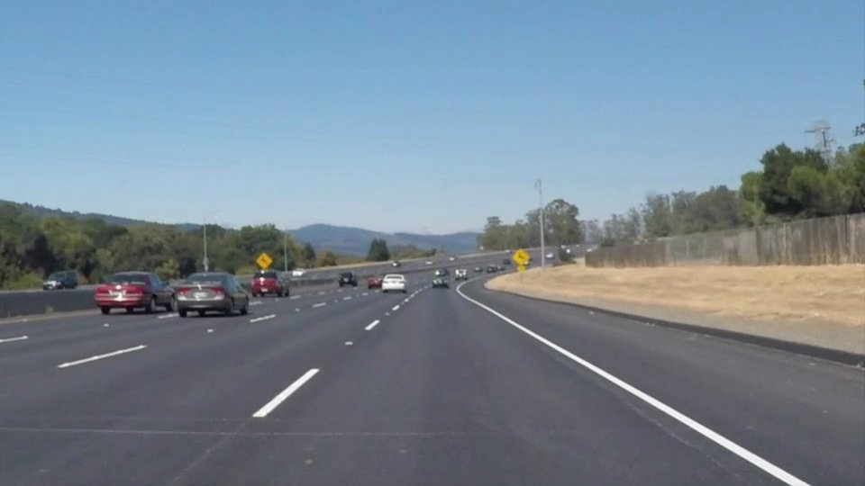
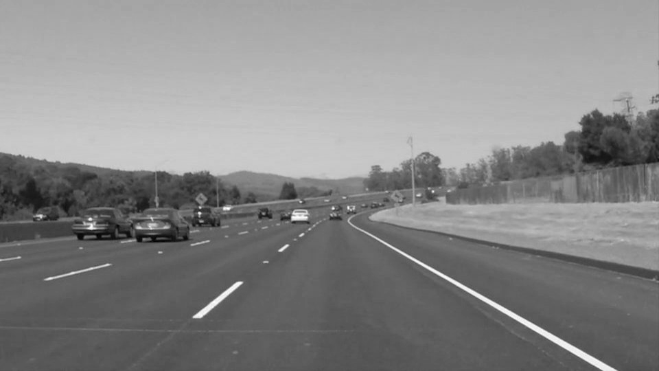
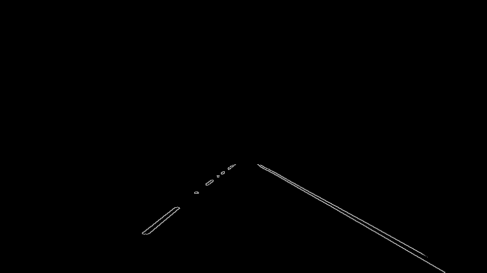
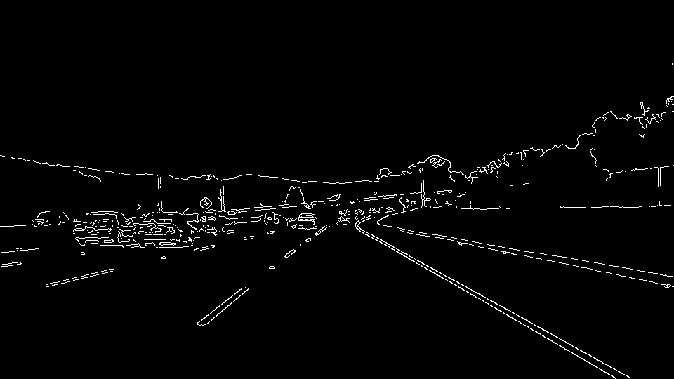
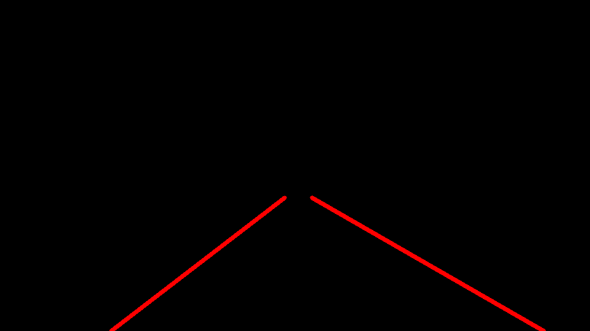
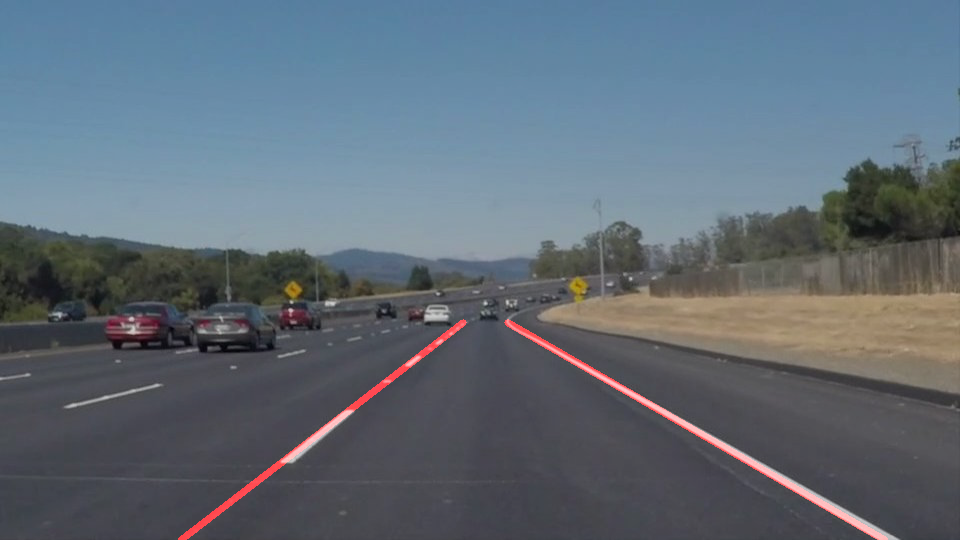

# **Project 1: Finding Lane Lines on the Road** 
  A self-driving car needs to determine the bounds of the lane of the road in which it needs to drive. In this project, we have built the core logic pipeline that will help the car identify the lane lines, which can be used to navigate.

**Goals**
The goals of this project are the following:
* Make a pipeline that finds lane lines on the road
* Reflect on the findings and the work involved in the project


---
### Sources:

 - Core
   - *P1.ipynb* : Source code containing the pipeline
   - *test_images/* : Directory containing the images taken as the input to the pipeline
   - *test_images/output* : Directory containing the output images and video with lane lines marked.
       
---
### Reflection

#### 1. Pipeline
Describe your pipeline. As part of the description, explain how you modified the draw_lines() function.

The following example illiustrates the steps in the pipeline in brief:

 - Consider the initial image as shown below.

  
---

 - First we convert Image to Grayscale. 
 
  
---

 -  Mask the region of interest where the lane lines are (possibly) located. Here we assume that the car (and thus the camera) is in the center of the lane. In order to remove the noise towards the detection of the lane lines we can mask the remaining region of the image.

  
---
 
 -   Edge detection
   Edge detection Detect the edges of the lane lines using canny edge detection algorithm. In python, this can be done as

  ```python
    edge = canny(blue_gray, 50, 150)
   ```
   
   The resulting image `edge` returned by canny is shown below.   

  
---

 -   Hough transform 

    We then perform hough transform over the edges detected to return the lines that mark the lane lines. We improve upon the the lines returned by the hough transform. A brief description of the improvement to `draw_lines()` which is called by `hough_lines()` is given in the following section. So we perform hough transform as

```python
    rho = 2 # distance resolution in pixels of the Hough grid
    theta = np.pi/180 # angular resolution in radians of the Hough grid
    threshold = 15     # minimum number of votes (intersections in Hough grid cell)
    min_line_length = 50 #minimum number of pixels making up a line
    max_line_gap = 80    # maximum gap between lines 


    line_edges = hough_lines(inner_mask, rho, theta, threshold,
                            min_line_length, max_line_gap)
```

  The resulting image `line_edges` has the lane lines marked as shown below.

  
---

 -  Finally we merge the image containing just the lane lines with the original image to mark the lane bounds.
   
    This is achieved by using `cv2.addWeighted`

  


-------
#### 2. Improvements to Hough transform in draw_lines()

  In order to draw a single line on the left and right lanes, I modified the ```draw_lines()``` function to aggregate and extrapolate the current set of lines generated. We have right and left lane and assume that the car drives in the center of the lane. To determine the lane lines we get the points that represent the lines from Hough transform and divide them according to their (approximate) position in the image. (Note: Another approach is to divide the lines by positive and negative slope, except that the lines representing the edges of lanes detected on either side might have negative or positive slopes adding to noise when selection; In that case we can add a second filter by x position)
   
   Once we have the points that belong to each of the lane lines we try to find the lane lines by fitting the points to a line with linear regression. We can get the resulting line with:
   
   ```python
   #x_points and y_points are the lists of x and y coordinates of the points respectively 
   slope, intercept, r_value, p_value, std_err = stats.linregress(x_points,y_points)
   ```

   From this line representation we can get the values for the top_x, top_y and bottom_x, bottom_y for the fitted line that represents the lane. bottom_y is fixed, which is the height of the image which we can get from ```image.shape```. The coordinate bottom_x is the x-coordinate of this point where the line would intersect with the bottom of the image, which we can grab using the equation y = mx + b. In python this can be written as:

```python
  def get_x_coordinate_for_y(y, slope, intercept):
      x = (y - intercept)/slope
      return np.uint32(x)
```
  
  To get the top coordinates we calculate the minimum values for the y-coordinates evaluated on the line equation
  
  ```python
  polynomial = np.poly1d([slope, intercept])
  line = polynomial(x_points)
  ```
  
  Hence, minimum value in ```line``` would be top_y, and we can get top_x from the function ```get_x_coordinate_for_y```. Note that this might be different than ```x_points[i]```, where i is the index of minimum in ```line```, since this x might not exactly lie on the line but be close to it. 
  
  Now that we have the top_x, top_y, bottom_x, bottom_y we can draw both the lanes with cv2.line on a blank image, which should give us the lane lines.
  
  
-----

#### 3. Identify potential shortcomings with your current pipeline

###### a) Approach Shortcomings:
- One shortcoming is the parameters for the region of interest are dependent on the the initial angle for the lane lines and their position in the image (decided by the position of the camera w.r.t. the road). More complex and sharp turns might not return correct lanes. Similarly the code is not tested for the lane lines when the road turns (sharply), which might cause error in determining the bounds of the lanes correctly.

 - The code is also not tested for correctness in cases where the signs painted on the road, but which are not part of the lines e.g. "STOP", Direction arrows like right turn or "ONE WAY" or simply the pedestrian crossing.

###### b) Implementation Shortcomings:
 - One potential shortcoming would be what would happen when there is noise in the detected Hough Transform. The line fitted by the linear regression is further away from what it should be. 

 - Another shortcoming is each set of lane lines determined in a image/frame of a video is independent of the previous frame. This can cause flicker due to changes in the frame lines or sudden changes in the line lengths or angle due to noise or other errors.


#### 4. Suggest possible improvements to your pipeline
 - A possible improvement for reducing the noise from the lines returned from the Hough transform is to mask the region that should not have lane edges assuming we are driving in the center of the lane and the camera position is fixed.
 - Fitting the points to a curve instead of line can improve the lane bounds that are detected
 - A possible way to reduce the flicker and smoothen the sudden changes in the lanes in the video is to remember previous N frames and aggregate the position of the lane lines.
 - Finally other edge detection algorithms like Sobel or PST should be tested for better results.

#### 5. Notes

These and additional experimental sources (e.g. comparision between different parameters and algorithms) are located at 
 
https://github.com/abhirk/CarND-LaneLines-P1.git


